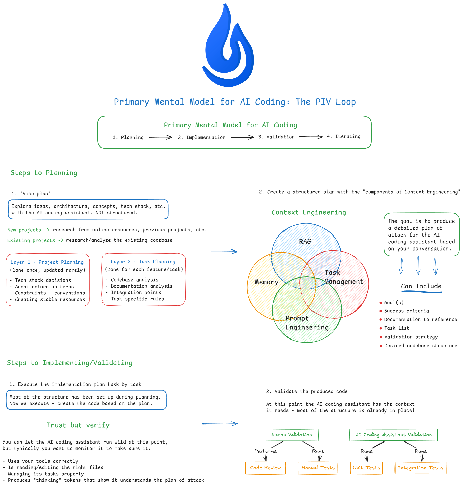

# Habit Tracker

> **Workshop participants:** For the template and starting point, switch to the [`workshop`](https://github.com/coleam00/habit-tracker/tree/workshop) branch.

A personal habit tracking web application for building and maintaining daily habits through streak tracking, completion rates, and calendar visualization. Built with FastAPI (Python) backend and React frontend, this local-first application runs entirely on your machine with no account required—just simple, distraction-free habit tracking.

## Prerequisites

- **Python 3.11+** with [uv](https://github.com/astral-sh/uv) package manager
- **Node.js 18+** with npm
- **Git** (optional, for cloning)

## Quick Start

### 1. Clone and Setup Backend

```bash
cd backend
uv sync
uv run uvicorn app.main:app --reload --port 8000
```

Backend runs at http://localhost:8000 (API docs at http://localhost:8000/docs)

### 2. Setup Frontend (new terminal)

```bash
cd frontend
npm install
npm run dev
```

Frontend runs at http://localhost:5173

### 3. Open the App

Navigate to **http://localhost:5173** in your browser. Create your first habit and start tracking!

## Architecture

```
┌─────────────────┐     HTTP/JSON      ┌─────────────────┐
│  React + Vite   │ ◄───────────────► │    FastAPI      │
│   Port 5173     │                    │   Port 8000     │
└─────────────────┘                    └────────┬────────┘
                                                │
                                       ┌─────────────────┐
                                       │     SQLite      │
                                       │   habits.db     │
                                       └─────────────────┘
```

### Tech Stack

| Layer | Technology |
|-------|------------|
| Backend | Python 3.11, FastAPI, SQLAlchemy, SQLite |
| Frontend | React 18, Vite, TanStack Query, Tailwind CSS |
| Date Handling | date-fns |

### Project Structure

```
habit-tracker/
├── backend/
│   ├── app/
│   │   ├── main.py           # FastAPI entry point
│   │   ├── database.py       # SQLite connection
│   │   ├── models.py         # SQLAlchemy models (Habit, Completion)
│   │   ├── schemas.py        # Pydantic request/response schemas
│   │   └── routers/          # API endpoints
│   │       ├── habits.py     # CRUD + streak calculation
│   │       └── completions.py
│   └── tests/                # pytest tests
├── frontend/
│   ├── src/
│   │   ├── features/
│   │   │   ├── habits/       # Habit components, hooks, API
│   │   │   └── calendar/     # Calendar view components
│   │   ├── components/ui/    # Shared UI components
│   │   ├── pages/            # Route pages
│   │   └── lib/              # Utilities
│   └── package.json
└── README.md
```

## Features

- **Daily Habit Tracking** — Create habits, mark them complete with one click
- **Streak Tracking** — See current streak and completion rate per habit
- **Calendar View** — Monthly grid showing completion history with color-coded days
- **Planned Absences** — Skip days without breaking your streak
- **Local & Private** — All data stored locally in SQLite, no account needed

## API Endpoints

| Method | Endpoint | Description |
|--------|----------|-------------|
| GET | `/api/habits` | List all habits with stats |
| POST | `/api/habits` | Create a new habit |
| POST | `/api/habits/{id}/complete` | Mark habit complete for a date |
| DELETE | `/api/habits/{id}/completions/{date}` | Undo a completion |
| GET | `/api/habits/{id}/completions` | Get completion history |

Full API documentation available at http://localhost:8000/docs when backend is running.

## Claude Commands

Slash commands for Claude Code to assist with development workflows. The AI coding workflow used to build this application follows the PIV (Prime, Implement, Validate) loop shown below:



### Planning & Execution
| Command | Description |
|---------|-------------|
| `/core_piv_loop:prime` | Load project context and codebase understanding |
| `/core_piv_loop:plan-feature` | Create comprehensive implementation plan with codebase analysis |
| `/core_piv_loop:execute` | Execute an implementation plan step-by-step |

### Validation
| Command | Description |
|---------|-------------|
| `/validation:validate` | Run full validation: tests, linting, coverage, frontend build |
| `/validation:code-review` | Technical code review on changed files |
| `/validation:code-review-fix` | Fix issues found in code review |
| `/validation:execution-report` | Generate report after implementing a feature |
| `/validation:system-review` | Analyze implementation vs plan for process improvements |

### Bug Fixing
| Command | Description |
|---------|-------------|
| `/github_bug_fix:rca` | Create root cause analysis document for a GitHub issue |
| `/github_bug_fix:implement-fix` | Implement fix based on RCA document |

### Misc
| Command | Description |
|---------|-------------|
| `/commit` | Create atomic commit with appropriate tag (feat, fix, docs, etc.) |
| `/init-project` | Install dependencies, start backend and frontend servers |
| `/create-prd` | Generate Product Requirements Document from conversation |
